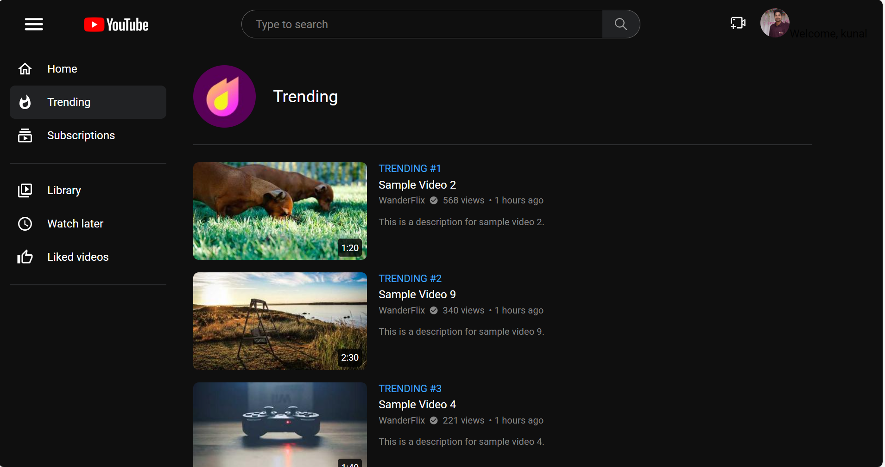
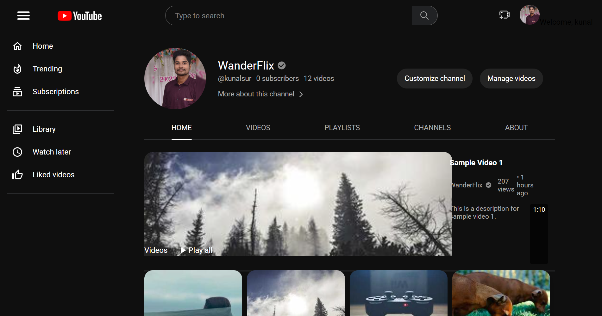

# YouTube Clone MERN Project

[](https://github.com/Kunal-2001-12)

> **Demo:** _Add your live deployment link here if available._

> **Author:** [Kunal Sur](https://github.com/Kunal-2001-12)

---

## Table of Contents
- [Features](#features)
- [Screenshots](#screenshots)
- [Project Structure](#project-structure)
- [Installation & Setup](#installation--setup)
  - [1. Prerequisites](#1-prerequisites)
  - [2. Clone the Repository](#2-clone-the-repository)
  - [3. Install Dependencies](#3-install-dependencies)
  - [4. Environment Variables](#4-environment-variables)
  - [5. Running the Project](#5-running-the-project)
- [Usage](#usage)
- [Project Details](#project-details)
- [API Endpoints](#api-endpoints)
- [Technologies Used](#technologies-used)
- [Contributing](#contributing)
- [License](#license)

---

## Features
- User registration and login (JWT authentication)
- Upload, view, and manage videos
- Create and manage channels
- Like, comment, and share videos
- Create, edit, and manage playlists
- YouTube Studio for channel/content management
- Watch later, subscriptions, and library features
- Trending videos and search functionality
- Password reset via email
- Responsive design for desktop and mobile
- Modern UI with React, MUI, and custom CSS

---

## Screenshots

> **All screenshots are now organized in the `frontend/src/img/favorites/` folder.**
> Paste your screenshot images in that folder and update the links below as needed.

| Feature/Page         | Screenshot                                                   |
|---------------------|-------------------------------------------------------------|
| Home                |        |
| Trending            |          |
| Channel             |            |
| Video Player        |   |
| Studio Dashboard    |     |
| Channel Content     |  |
| Successful Login    |  |


---

## Output Screenshots

> **Add your output/result screenshots in the `frontend/src/img/favorites/` folder and reference them here.**

| Output/Result Description | Screenshot                                                   |
|--------------------------|-------------------------------------------------------------|
| Successful Login         |   |
| Video Upload Success     |  |
| Playlist Created         |  |
| Comment Posted           |  |
| Like/Dislike Action      |     |
| Watch Later Added        |  |
| Password Reset Email     |   |
| Error/404 Page           |       |

> Paste your output screenshots in the `frontend/src/img/favorites/` folder and update the links above as needed.

---

## Project Structure
```
YouTube-clone-MERN-main/
  backend/      # Node.js + Express API
  frontend/     # React.js client
  README.md     # Project documentation
  docker-compose.yml
```

---

## Installation & Setup

### 1. Prerequisites
- [Node.js](https://nodejs.org/) (v16+ recommended)
- [npm](https://www.npmjs.com/) (comes with Node.js)
- [MongoDB Atlas](https://www.mongodb.com/cloud/atlas) account (or local MongoDB)

### 2. Clone the Repository
```powershell
git clone <your-repo-url>
cd YouTube-clone-MERN-main
```

### 3. Install Dependencies
#### Backend
```powershell
cd backend
npm install
```
#### Frontend
```powershell
cd ../frontend
npm install
```

### 4. Environment Variables
#### Backend
Create a `.env` file in the `backend/` folder:
```
MONGO_URI=<your-mongodb-connection-string>
SECRET_KEY=<your-jwt-secret>
EMAIL=<your-email-for-nodemailer>
PASSWORD=<your-app-password-for-nodemailer>
BACKEND_URL=http://localhost:4000
```
#### Frontend
If you use any environment variables, set them in `frontend/.env` (optional).

### 5. Running the Project
#### Start Backend
```powershell
cd backend
npm run dev
```
- The backend will run on [http://localhost:4000](http://localhost:4000)

#### Start Frontend
Open a new terminal:
```powershell
cd frontend
npm run dev
```
- The frontend will run on [http://localhost:5173](http://localhost:5173) (default Vite port)

---

## Usage
- Register a new account or log in.
- Create your channel and upload videos.
- Browse, search, and filter videos on the home page.
- Watch videos, like/dislike, and comment.
- Manage your playlists, subscriptions, and watch later list.
- Use the Studio dashboard to manage your content and channel.

---

## Project Details
### Frontend (React)
- Home page with header, sidebar, video grid, and filters.
- User authentication (register, login, JWT, protected routes).
- Video player page with comments, like/dislike, and channel info.
- Channel page for managing videos and channel details.
- Search and filter functionality.
- Responsive design for all devices.

### Backend (Node.js, Express)
- RESTful API for users, videos, channels, comments, likes, playlists.
- JWT authentication and protected routes.
- MongoDB for storing users, videos, channels, comments, and metadata.
- Nodemailer for password reset and registration emails.

---

## API Endpoints (Major)
- `POST /signup` — Register
- `POST /login` — Login
- `GET /logout` — Logout
- `GET /userdata` — Get user info (requires cookies)
- `POST /resetlink` — Password reset email
- `POST /publish` — Upload video
- `GET /getvideos` — Get all videos
- `GET /videodata/:id` — Get video by ID
- `POST /comments/:id` — Add comment
- `POST /like/:id/:email/:email2` — Like video
- `POST /watchlater/:id/:email/:email2` — Add to watch later
- `GET /gettrending` — Trending videos
- `GET /search/:data` — Search videos
- ...and many more (see backend/Router/*.js)

---

## Technologies Used
- **MongoDB**: Database for user, video, and channel data
- **Express.js**: Backend API server
- **React.js**: Frontend SPA
- **Node.js**: Server runtime
- **Firebase Storage**: Video and file storage
- **JWT**: Authentication
- **Nodemailer**: Email for registration and password reset
- **MUI & React Icons**: UI components and icons
- **Docker**: Containerized deployment

---

## Contributing
Pull requests are welcome! For major changes, please open an issue first to discuss what you would like to change.

---

## License
This project is for educational purposes only.
